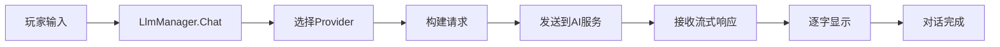

# LLM系统文档

> 基于UnLua的通用大语言模型集成系统
> 
> 版本：v1.0
> 
> 作者：derderFramework团队

---

## 📖 目录

1. [系统介绍](#系统介绍)
2. [核心概念](#核心概念)
3. [快速开始](#快速开始)
4. [详细使用指南](#详细使用指南)
5. [进阶功能](#进阶功能)
6. [实战案例](#实战案例)
7. [API参考](#api参考)
8. [常见问题](#常见问题)

---

## 一、系统介绍

### 1.1 这是什么？

**LLM系统**是一个集成到UE游戏引擎中的**大语言模型（Large Language Model）交互系统**，它让你的游戏能够：

- 🤖 **与AI对话**：让NPC、旁白、助手等角色拥有智能对话能力
- 📝 **动态内容生成**：实时生成故事、对话、物品描述等内容
- 🎭 **角色扮演**：AI可以扮演不同性格和身份的角色
- 🎮 **游戏互动**：AI可以调用游戏功能（如移动角色、触发事件）
- 💬 **流式显示**：支持打字机效果，提升玩家体验

### 1.2 为什么需要它？

传统游戏的对话和内容都是**预先写死**的，有以下局限：

❌ **内容固定**：玩家每次看到的都是相同的对话  
❌ **缺乏互动**：无法理解玩家的自由输入  
❌ **工作量大**：需要编写大量对话分支  
❌ **不够智能**：无法根据上下文灵活应对  

有了LLM系统后：

✅ **内容动态**：每次对话都可以不同，富有变化  
✅ **理解自然语言**：可以理解玩家的任意输入  
✅ **减少工作量**：AI自动生成内容，无需手写所有对话  
✅ **智能交互**：AI能记住上下文，做出合理回应  

### 1.3 支持哪些AI服务？

当前系统支持以下大语言模型提供商：

| 提供商 | 模型 | 特点 | 推荐场景 |
|--------|------|------|----------|
| **OpenAI** | GPT-4, GPT-3.5 | 最强大，英文最好 | 英文游戏、复杂对话 |
| **Claude** | Claude-3.5 | 安全性高，中文好 | 中文游戏、长对话 |
| **通义千问** | Qwen-Max | 中文最优，速度快 | **国内首选** |
| **本地模型** | 自定义 | 完全私有，免费 | 离线游戏、节省成本 |

> 💡 **推荐**：国内游戏建议使用**通义千问（Qwen）**，速度快、中文好、价格低。

---

## 二、核心概念

### 2.1 系统架构

LLM系统采用**分层架构**，严格遵循项目规范：

```
┌─────────────────────────────────────┐
│         应用层（你的代码）            │  ← 游戏逻辑、UI
├─────────────────────────────────────┤
│      Manager层（统一接口）            │  ← LlmManager
├─────────────────────────────────────┤
│      System层（业务逻辑）             │  ← 各种功能系统
├─────────────────────────────────────┤
│   BusinessModule层（数据加工）        │  ← BM_*
├─────────────────────────────────────┤
│   DataModule层（数据存储）            │  ← DM_*
└─────────────────────────────────────┘
```

**层次说明：**
- **DataModule**：存储原始数据（API Key、对话历史等）
- **BusinessModule**：加工数据（格式转换、验证等）
- **System**：实现具体功能（发送请求、解析响应等）
- **Manager**：提供统一接口（你只需要调用Manager）

### 2.2 核心组件

#### 2.2.1 Provider（提供商适配器）

不同AI服务的API格式不同，Provider负责适配：

```lua
OpenAIProvider    -- 适配OpenAI格式
ClaudeProvider    -- 适配Claude格式
QwenProvider      -- 适配通义千问格式
LocalProvider     -- 适配本地模型
```

你**无需关心**不同提供商的差异，切换只需一行代码。

#### 2.2.2 ChatType（对话场景）

预定义的业务场景类型，每种类型有专门的提示词模板：

| ChatType | 用途 | 示例 |
|----------|------|------|
| `character_dialogue` | 角色对话 | NPC交谈 |
| `narrator` | 游戏旁白 | 场景描述 |
| `story_advance` | 故事推进 | 剧情发展 |
| `combat_narrator` | 战斗解说 | 战斗描述 |
| `npc_interaction` | NPC互动 | 商店老板 |
| `item_description` | 物品描述 | 装备说明 |
| `general_chat` | 通用对话 | AI助手 |

#### 2.2.3 流式响应

AI的回复会**逐字显示**（打字机效果），而不是一次性出现：

```
传统方式：等待5秒 → 一次性显示完整回复
流式方式：立即开始 → 逐字显示 → 更好的体验
```

### 2.3 工作流程

完整的对话流程：



---

## 三、快速开始

### 3.1 最简单的例子（3行代码）

```lua
local GameContext = require("Core.GameContext")
local llmMgr = GameContext:GetLlmManager()

-- 1. 配置（只需要一次）
llmMgr:SetApiKey("sk-592ab9ea805f48b68940ece20b7afa39")
llmMgr:UseProvider("qwen")

-- 2. 开始对话（一行搞定）
llmMgr:Chat("general_chat", {
    userInput = "你好，请介绍一下你自己"
}, nil, function(success, result)
    print("AI回复:", result)
end)
```

**运行效果：**
```
AI回复: 你好！我是通义千问，一个由阿里云开发的大型语言模型...
```

### 3.2 完整初始化（推荐）

在GameMode的BeginPlay中初始化：

```lua
-- Content/Script/GameMode/GM_YourGame.lua
local GameContext = require("Core.GameContext")

function M:ReceiveBeginPlay()
    local llmMgr = GameContext:GetLlmManager()
    
    -- 配置AI服务
    llmMgr:SetApiKey("your-api-key")
    llmMgr:UseProvider("qwen")        -- 或 "openai", "claude"
    llmMgr:SetModel("qwen-max")       -- 选择模型
    
    -- 设置游戏世界背景（所有对话都会携带）
    llmMgr:SetGameWorld([[
你是一个科幻世界的AI助手。
这个世界充满了高科技和外星文明。
    ]])
    
    -- 设置游戏规则
    llmMgr:SetGameRules([[
- 保持科幻风格
- 对话简洁明了
- 富有想象力
    ]])
    
    -- 设置玩家数据
    llmMgr:UpdatePlayerData("name", "玩家昵称")
    llmMgr:UpdatePlayerData("level", 1)
    llmMgr:UpdatePlayerData("faction", "联邦军")
    
    print("LLM系统初始化完成")
end

-- ⚠️ 重要：必须驱动Tick（流式响应需要）
function M:ReceiveTick(DeltaSeconds)
    local llmMgr = GameContext:GetLlmManager()
    if llmMgr then
        llmMgr:Tick(DeltaSeconds)  -- 关键！
    end
end
```

---

## 四、详细使用指南

### 4.1 基础对话

#### 4.1.1 非流式对话（简单）

等待AI完整回复后一次性显示：

```lua
llmMgr:Chat("general_chat", {
    userInput = "什么是量子计算？"
}, nil, function(success, result)
    if success then
        print("AI:", result)
    else
        print("错误:", result)
    end
end)
```

#### 4.1.2 流式对话（打字机效果）

AI回复逐字显示，体验更好：

```lua
local currentText = ""

llmMgr:Chat("general_chat", {
    userInput = "讲一个科幻故事"
}, function(delta)
    -- 流式回调：每收到一小段文字就调用
    currentText = currentText .. delta
    TextBlock:SetText(currentText)  -- 实时更新UI
end, function(success, fullText)
    -- 完成回调：整个回复结束
    print("故事讲完了，总共", #fullText, "个字")
end)
```

### 4.2 使用不同的ChatType

#### 4.2.1 角色对话

让NPC拥有个性化对话：

```lua
llmMgr:Chat("character_dialogue", {
    characterName = "机械师老王",
    mood = "兴奋",
    userInput = "能帮我修飞船吗？"
}, onStream, onComplete)
```

**效果：**
> AI会扮演"机械师老王"，带着"兴奋"的情绪回复你

#### 4.2.2 游戏旁白

生成场景描述：

```lua
llmMgr:Chat("narrator", {
    scene = "废弃空间站",
    sceneDesc = "黑暗、寂静、漂浮的残骸"
}, onStream, onComplete)
```

**效果：**
> 你来到了一座废弃的空间站，四周一片黑暗，只有破碎的金属残骸在微弱的星光下闪烁...

#### 4.2.3 NPC互动

与商人、任务发布者等NPC交互：

```lua
llmMgr:Chat("npc_interaction", {
    npcName = "军火商莉莉",
    npcRole = "武器商人",
    npcPersonality = "精明、谨慎",
    relationshipLevel = "陌生人",
    userInput = "有什么好武器？"
}, onStream, onComplete)
```

#### 4.2.4 物品描述

动态生成装备说明：

```lua
llmMgr:Chat("item_description", {
    itemName = "等离子步枪",
    itemType = "武器",
    itemRarity = "史诗"
}, nil, function(success, description)
    ItemTooltip:SetText(description)
end)
```

### 4.3 切换AI服务

#### 4.3.1 使用通义千问（推荐）

```lua
llmMgr:SetApiKey("sk-592ab9ea805f48b68940ece20b7afa39")
llmMgr:UseProvider("qwen")
llmMgr:SetModel("qwen-max")  -- 或 qwen-plus, qwen-turbo
```

#### 4.3.2 使用OpenAI

```lua
llmMgr:SetApiKey("sk-xxx")
llmMgr:UseProvider("openai")
llmMgr:SetModel("gpt-4")  -- 或 gpt-3.5-turbo
```

#### 4.3.3 使用Claude

```lua
llmMgr:SetApiKey("sk-ant-xxx")
llmMgr:UseProvider("claude")
llmMgr:SetModel("claude-3-5-sonnet-20241022")
```

#### 4.3.4 使用本地模型

```lua
llmMgr:UseProvider("local", "localhost", 8080)
llmMgr:SetApiKey("")  -- 本地模型可能不需要密钥
```

### 4.4 调整生成参数

```lua
-- 温度：0-2，越高越随机创意，越低越稳定
llmMgr:SetTemperature(0.8)  -- 默认0.7

-- 最大长度：生成文本的最大token数
llmMgr:SetMaxTokens(2000)  -- 默认2000
```

**温度对比：**
- **0.3**：严肃、正式、逻辑性强（适合客服、教学）
- **0.7**：平衡（默认，适合大多数场景）
- **1.2**：创意、天马行空（适合故事创作）

---

## 五、进阶功能

### 5.1 自定义ChatType

创建你自己的对话场景：

```lua
llmMgr:RegisterChatType("tech_support", {
    systemPrompt = [[你是{companyName}的技术支持工程师。

## 支持内容
产品：{productName}
问题类型：{issueType}

## 回复原则
1. 专业、耐心
2. 提供具体解决方案
3. 如果无法解决，引导联系人工客服

用户问题：{userInput}]],
    
    tools = {},  -- 可用的工具列表
    temperature = 0.5,  -- 较低温度，更稳定
    maxTokens = 500
})

-- 使用自定义ChatType
llmMgr:Chat("tech_support", {
    companyName = "银河科技",
    productName = "量子通讯器",
    issueType = "连接问题",
    userInput = "设备无法连接"
}, onStream, onComplete)
```

### 5.2 注册自定义工具

让AI可以调用游戏功能：

```lua
llmMgr:RegisterTool({
    name = "open_inventory",
    description = "打开玩家的背包界面",
    parameters = {
        type = "object",
        properties = {
            tab = {
                type = "string",
                enum = {"all", "weapons", "armor", "consumables"},
                description = "要打开的标签页"
            }
        },
        required = {}
    },
    execute = function(args)
        -- 实际执行：打开背包UI
        local tab = args.tab or "all"
        UIManager:OpenInventory(tab)
        
        return {
            success = true,
            message = "已打开背包：" .. tab .. "标签页"
        }
    end
})
```

**AI如何调用工具：**

当玩家说"我想看看我的武器"时，AI会自动：
1. 理解用户意图
2. 决定调用 `open_inventory` 工具
3. 传入参数 `{tab: "weapons"}`
4. 执行工具
5. 根据执行结果回复玩家

### 5.3 上下文管理

#### 5.3.1 更新玩家状态

```lua
-- 实时更新玩家信息，AI会自动获取
llmMgr:UpdatePlayerData("health", 75)
llmMgr:UpdatePlayerData("location", "火星基地")
llmMgr:UpdatePlayerData("quest", "寻找失落的文明")
```

#### 5.3.2 清空对话历史

```lua
-- 开始新对话时清空
llmMgr:ClearHistory()
```

#### 5.3.3 限制历史长度

```lua
-- 在BM_LlmContext中设置
BM_LlmContext.dataModule.maxHistoryLength = 20  -- 保留最近20条
```

---

## 六、实战案例

### 6.1 案例一：AI助手NPC

创建一个游戏内的AI助手：

```lua
-- Content/Script/GamePlay/AIAssistantNPC.lua
local GameContext = require("Core.GameContext")
local Consts = require("Util.Consts")

local AIAssistant = {}

function AIAssistant:Initialize()
    self.llmMgr = GameContext:GetLlmManager()
    
    -- 配置
    self.llmMgr:SetApiKey("your-key")
    self.llmMgr:UseProvider("qwen")
    
    -- 设置助手角色
    self.llmMgr:SetGameWorld("你是玩家的AI助手小Q")
end

function AIAssistant:OnPlayerTalk(playerInput)
    self.llmMgr:Chat(Consts.ChatType.GENERAL_CHAT, {
        userInput = playerInput
    }, function(delta)
        -- 流式显示对话气泡
        self:UpdateDialogueBubble(delta)
    end, function(success, fullText)
        -- 对话结束，播放说完的动画
        self:PlayTalkEndAnimation()
    end)
end

return AIAssistant
```

### 6.2 案例二：动态任务描述

根据玩家状态生成任务描述：

```lua
function QuestSystem:GenerateQuestDescription(questId)
    local llmMgr = GameContext:GetLlmManager()
    
    llmMgr:Chat("story_advance", {
        storyPoint = "接受新任务",
        playerChoice = "选择接受" .. questId
    }, nil, function(success, description)
        if success then
            QuestUI:ShowDescription(description)
        end
    end)
end
```

### 6.3 案例三：战斗解说系统

实时解说战斗过程：

```lua
function CombatNarrator:OnCombatAction(action)
    local llmMgr = GameContext:GetLlmManager()
    
    llmMgr:Chat("combat_narrator", {
        enemyName = action.enemy.name,
        playerAction = action.type,  -- "attack", "dodge", "skill"
        combatStatus = self:GetCombatStatus()
    }, function(delta)
        -- 流式显示解说文字
        CombatUI:AppendNarration(delta)
    end, nil)
end
```

### 6.4 案例四：AI聊天UI

完整的聊天界面（参考 `UI/AI/WBP_AIChat.lua`）：

```lua
function ChatWidget:OnSendMessage()
    local userInput = self.InputBox:GetText()
    self.InputBox:SetText("")
    
    -- 显示用户消息
    self:AddUserMessage(userInput)
    
    -- 创建AI消息占位符
    self:CreateAIMessageWidget()
    
    -- 发送到AI
    llmMgr:Chat("general_chat", { userInput = userInput },
        function(delta)
            -- 逐字更新AI消息
            self.currentAIMessage:AppendText(delta)
        end,
        function(success, fullText)
            -- 完成
            self:OnAIReplyComplete()
        end
    )
end
```

---

## 七、API参考

### 7.1 LlmManager API

#### 配置方法

```lua
-- 设置API密钥
llmMgr:SetApiKey(apiKey: string)

-- 选择Provider
llmMgr:UseProvider(provider: string, ...)
  -- provider: "openai" | "claude" | "qwen" | "local"

-- 设置模型
llmMgr:SetModel(model: string)

-- 设置温度
llmMgr:SetTemperature(temperature: number)  -- 0-2

-- 设置最大Token
llmMgr:SetMaxTokens(maxTokens: number)
```

#### 上下文方法

```lua
-- 设置游戏世界观
llmMgr:SetGameWorld(worldSetting: string)

-- 设置游戏规则
llmMgr:SetGameRules(rules: string)

-- 设置玩家身份
llmMgr:SetPlayerIdentity(identity: string)

-- 更新玩家数据
llmMgr:UpdatePlayerData(key: string, value: any)

-- 清空对话历史
llmMgr:ClearHistory()
```

#### 核心方法

```lua
-- 发送对话
llmMgr:Chat(
    chatType: string,           -- ChatType类型
    params: table,              -- 参数表
    onStream: function(delta),  -- 流式回调（可选）
    onComplete: function(success, result)  -- 完成回调
)
```

#### 扩展方法

```lua
-- 注册自定义ChatType
llmMgr:RegisterChatType(chatType: string, template: table)

-- 注册自定义工具
llmMgr:RegisterTool(toolDef: table)

-- 驱动异步（必须在Tick中调用）
llmMgr:Tick(deltaTime: number)
```

### 7.2 ChatType列表

| ChatType | 必需参数 | 可选参数 |
|----------|----------|----------|
| `general_chat` | userInput | - |
| `character_dialogue` | characterName, mood, userInput | - |
| `narrator` | scene, sceneDesc | - |
| `story_advance` | storyPoint, playerChoice | - |
| `combat_narrator` | enemyName, playerAction, combatStatus | - |
| `npc_interaction` | npcName, npcRole, npcPersonality, relationshipLevel, userInput | - |
| `item_description` | itemName, itemType, itemRarity | - |

### 7.3 回调函数签名

```lua
-- 流式回调
function onStream(delta: string)
    -- delta: 新接收到的文本片段
end

-- 完成回调
function onComplete(success: boolean, result: string)
    -- success: 是否成功
    -- result: 完整回复文本（成功）或错误信息（失败）
end
```

---

## 八、常见问题

### Q1: 流式显示不工作，AI回复一次性出现？

**原因**：GameMode没有驱动Tick

**解决**：
```lua
function M:ReceiveTick(DeltaSeconds)
    GameContext:GetLlmManager():Tick(DeltaSeconds)
end
```

### Q2: 报错"无法获取LLM管理器"？

**原因**：GameContext未初始化

**解决**：在GameMode的BeginPlay中：
```lua
if not GameContext._isInitialized then
    GameContext:initialize(self)
end
```

### Q3: API请求超时？

**检查**：
1. 网络连接是否正常
2. API Key是否正确
3. 是否被防火墙拦截

**解决**：增加超时时间
```lua
llmMgr:SetTimeout(60)  -- 60秒
```

### Q4: 如何查看请求详情和调试？

**查看控制台日志**：系统会打印详细信息
```
[LlmClientSystem] 发送请求...
[LlmStreamSystem] 接收chunk...
[LlmReActSystem] 完成回复
```

### Q5: 中文乱码？

**解决**：确保Lua文件保存为UTF-8编码

### Q6: 消耗token太快，费用高？

**优化建议**：
1. 使用较小的模型（qwen-turbo而不是qwen-max）
2. 减少历史长度
3. 精简提示词
4. 使用本地模型

### Q7: AI回复不符合预期？

**调整方法**：
1. 修改ChatType的systemPrompt
2. 调整temperature（更低=更稳定）
3. 提供更详细的参数
4. 添加示例对话

### Q8: 如何防止玩家滥用？

**限制措施**：
```lua
-- 添加冷却时间
if os.time() - self.lastRequestTime < 3 then
    print("请等待3秒再发送")
    return
end

-- 限制请求长度
if #userInput > 500 then
    print("输入过长，请简短一些")
    return
end

-- 限制每日次数
if self.todayRequestCount >= 100 then
    print("今日请求次数已用完")
    return
end
```

---

## 九、性能优化

### 9.1 减少请求次数

```lua
-- ❌ 不好：每次都请求
for i = 1, 10 do
    llmMgr:Chat("item_description", {...})
end

-- ✅ 好：批量请求或缓存
local descriptions = {}
llmMgr:Chat("batch_item_description", {
    items = {...}
}, nil, function(success, result)
    descriptions = result
end)
```

### 9.2 控制流式更新频率

```lua
-- 累积多个chunk再更新UI
self.chunkBuffer = {}
function OnStream(delta)
    table.insert(self.chunkBuffer, delta)
    
    if #self.chunkBuffer >= 5 then  -- 每5个chunk更新一次
        local combined = table.concat(self.chunkBuffer)
        UI:UpdateText(combined)
        self.chunkBuffer = {}
    end
end
```

### 9.3 限制历史长度

```lua
-- 保留最近20条对话
llmMgr:SetMaxHistory(20)
```

---

## 十、最佳实践

### 10.1 提示词编写技巧

**好的提示词：**
```lua
systemPrompt = [[你是{npcName}，一个{npcRole}。

## 角色设定
- 性格：{personality}
- 背景：{background}
- 目标：{goal}

## 对话规则
1. 保持角色一致性
2. 回复简洁（不超过3句话）
3. 使用{language}语言
4. 符合{worldSetting}世界观

用户说：{userInput}]]
```

**不好的提示词：**
```lua
systemPrompt = "你是NPC，回答问题"  -- 太简单，没有约束
```

### 10.2 错误处理

```lua
llmMgr:Chat(chatType, params, onStream, function(success, result)
    if success then
        -- 成功处理
        UI:ShowResult(result)
    else
        -- 错误处理
        if string.find(result, "timeout") then
            UI:ShowError("网络超时，请重试")
        elseif string.find(result, "401") then
            UI:ShowError("API密钥无效")
        else
            UI:ShowError("未知错误：" .. result)
        end
    end
end)
```

### 10.3 测试建议

```lua
-- 创建测试用例
local function TestLLM()
    local llmMgr = GameContext:GetLlmManager()
    
    -- 测试1：基础对话
    llmMgr:Chat("general_chat", {
        userInput = "你好"
    }, nil, function(success, result)
        assert(success, "基础对话失败")
        print("✓ 基础对话测试通过")
    end)
    
    -- 测试2：流式响应
    local chunkCount = 0
    llmMgr:Chat("general_chat", {
        userInput = "讲个故事"
    }, function(delta)
        chunkCount = chunkCount + 1
    end, function(success, result)
        assert(chunkCount > 0, "流式响应失败")
        print("✓ 流式测试通过，收到", chunkCount, "个chunk")
    end)
end
```

---

## 十一、参考资源

### 11.1 文档链接

- **本地文档**：
  - 快速指南：`GameLayer/Llm/QWEN_QUICKSTART.md`
  - 完整文档：`GameLayer/Llm/README.md`
  - UI设置：`UI/AI/README_SETUP.md`

- **测试用例**：
  - 通用测试：`Test/LlmStreamTest.lua`
  - 通义千问测试：`Test/QwenTest.lua`

### 11.2 外部资源

- [OpenAI API文档](https://platform.openai.com/docs)
- [Claude API文档](https://docs.anthropic.com/)
- [通义千问API文档](https://bailian.console.aliyun.com/)

### 11.3 示例代码

完整的示例代码位于：
- AI聊天UI：`Content/Script/UI/AI/WBP_AIChat.lua`
- GameMode示例：`Content/Script/GameMode/GM_AITest.lua`

---

## 十二、更新日志

### v1.0 (2024-10)
- ✅ 支持OpenAI、Claude、通义千问、本地模型
- ✅ 流式异步响应
- ✅ ChatType配置化
- ✅ 工具调用（Function Calling）
- ✅ ReAct架构
- ✅ 完整文档和测试用例

---

## 📞 技术支持

如有问题，请：
1. 查阅本文档的[常见问题](#常见问题)章节
2. 查看控制台日志定位问题
3. 参考测试用例代码
4. 联系开发团队

---

**祝你使用愉快！🎉**


